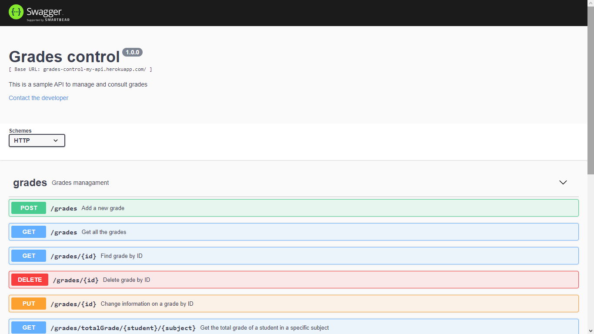
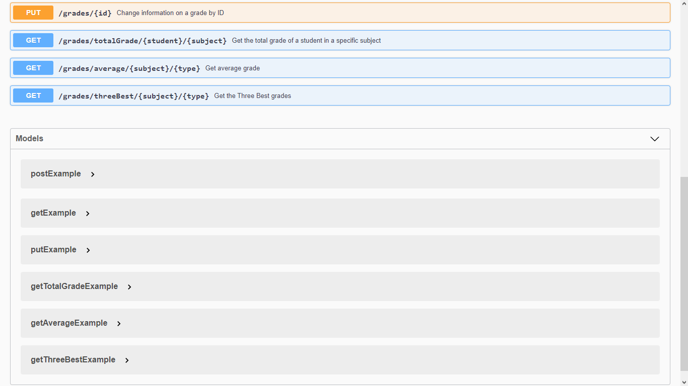

<h1 align = 'center'> Grades Control API</h1>

<h2 align = 'center'>
<a href="https://grades-control-my-api.herokuapp.com/grades-control-api/doc/">Documentation</a>
</h2>
<p float="left">
  
  
</p>

---

## 📗 About

This API simulates **management and control of a grading system**. It enables the ability to **create, modify and delete** new grades, in addition to getting some relevant informations.

---

## 💻 Technologies

- [Node.js](https://nodejs.org/en/docs/)
- [Express](http://expressjs.com/en/api.html)
- [JWT](https://jwt.io/introduction/)
- [Swagger](https://swagger.io/docs/)

---

## 📁 Installing the project

```cmd
$ git clone https://github.com/limaedu/grades-control-api

$ npm init

$ npm install

$ nodemon --experimental-modules src/index.js
```
